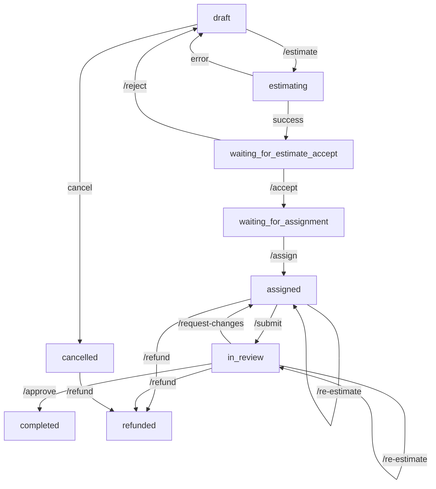

# Project Lifecycle - Complete Implementation Guide

**Date:** 2025-11-09
**Status:** ✅ **Backend Complete** - All API endpoints implemented
**Next Steps:** UI Implementation (Specialist Dashboard, Admin Dashboard, User Project Actions)

---

## 🎉 What Was Implemented

### 1. Database Schema Updates ✅

**Added to User model:**
- `credits` (Int) - User's available credits (1 credit = $0.01)
- `creditLedger` relation

**Added to Project model:**
- `request` (String) - Detailed user request for estimation
- `actualCost` (Float) - Final actual cost after completion
- `assignedAt` (DateTime) - When expert was assigned
- `submittedAt` (DateTime) - When work was submitted
- `reviewedAt` (DateTime) - When user reviewed work
- `rating` (Int 1-5) - User's rating of the work
- `feedback` (String) - User's feedback
- `creditLedger` relation

**New Model: CreditLedger**
- Tracks all credit transactions
- Types: `PROJECT_RESERVATION`, `PROJECT_COMPLETION`, `PROJECT_REFUND`, `CREDIT_PURCHASE`
- Links to users and projects

**Updated Statuses:**
```
draft → estimating → waiting_for_estimate_accept → estimate_accepted →
waiting_for_assignment → assigned → in_review → completed/refunded/cancelled
```

---

## 2. New API Endpoints ✅

### User Endpoints

#### **POST /api/projects/[id]/estimate**
Get AI estimation for project (updated)
- **Body:** `{ request: string }` - User's detailed request
- **Returns:** Estimation with status `waiting_for_estimate_accept`
- **Status Flow:** `draft` → `estimating` → `waiting_for_estimate_accept`

#### **POST /api/projects/[id]/estimate/accept**
Accept estimate and reserve credits
- **Body:** None
- **Checks:** User has enough credits
- **Action:** Deducts credits, creates ledger entry
- **Status Flow:** `waiting_for_estimate_accept` → `waiting_for_assignment`
- **Returns:** `402` if insufficient credits with shortfall amount

#### **POST /api/projects/[id]/estimate/reject**
Reject estimate and return to draft
- **Body:** `{ reason?: string }`
- **Status Flow:** `waiting_for_estimate_accept` → `draft`
- **Keeps:** Previous estimate for reference

#### **POST /api/projects/[id]/approve**
Approve completed work
- **Body:** `{ rating: number (1-5), feedback?: string }`
- **Action:** Pays expert, updates ratings
- **Status Flow:** `in_review` → `completed`
- **Creates:** `PROJECT_COMPLETION` ledger entry

#### **POST /api/projects/[id]/request-changes**
Request revisions to submitted work
- **Body:** `{ feedback: string }`
- **Action:** Returns project to expert
- **Status Flow:** `in_review` → `assigned`
- **Stores:** Revision history in metadata

### Specialist Endpoints

#### **POST /api/projects/[id]/submit**
Submit completed work for review
- **Body:** `{ audioIds: string[], notes?: string }`
- **Checks:** Project is assigned to this expert
- **Status Flow:** `assigned` → `in_review`
- **Stores:** Submitted audio IDs and notes

### Admin Endpoints

#### **POST /api/projects/[id]/assign** (updated)
Assign project to expert
- **Now checks:** Status must be `waiting_for_assignment`
- **Now sets:** `assignedAt` timestamp
- **Status Flow:** `waiting_for_assignment` → `assigned`

#### **POST /api/projects/[id]/re-estimate**
Request new estimate for scope changes
- **Body:** `{ newEstimate: number, reason: string, adminNotes?: string }`
- **Allowed:** When status is `assigned` or `in_review`
- **Stores:** Estimate history
- **Calculates:** Additional credits needed

#### **POST /api/projects/[id]/refund**
Issue refund for cancelled/failed project
- **Body:** `{ reason: string, refundAmount?: number, adminNotes?: string }`
- **Action:** Returns credits to user
- **Status Flow:** any → `refunded`
- **Creates:** `PROJECT_REFUND` ledger entry

---

## 3. Complete Status Flow ✅



---

## 4. Credit System Flow ✅

### When User Accepts Estimate:
1. Check `user.credits >= estimatedCost * 100`
2. If insufficient: Return `402` with shortfall details
3. Deduct credits from user
4. Create `PROJECT_RESERVATION` ledger entry (negative amount)

### When Work is Approved:
1. Add credits to expert user
2. Create `PROJECT_COMPLETION` ledger entry (positive amount)
3. Update expert's rating and completed jobs count
4. Mark project as completed

### When Refund is Issued:
1. Return credits to user
2. Create `PROJECT_REFUND` ledger entry (positive amount)
3. Mark project as refunded

---

## 5. Implementation Details

### Error Handling
All endpoints return structured errors:
```json
{
  "error": "Human-readable error message",
  "details": "Detailed explanation",
  "currentStatus": "project_status" // when applicable
}
```

### Validation
All endpoints use Zod schemas for input validation:
- Project IDs validated as CUIDs
- Required fields enforced
- Min/max lengths for strings
- Proper types for numbers

### Transactions
Credit operations use Prisma transactions to ensure atomicity:
- Accept estimate: deduct credits + create ledger + update project
- Approve work: pay expert + create ledger + update project + update expert profile
- Refund: return credits + create ledger + update project

### Metadata Storage
Complex data stored in JSON fields:
- `estimationData` - Stores submission notes, revision history, estimate history
- `creditLedger.metadata` - Stores transaction context

---

## 📱 UI Implementation Guide

### User Project Detail Page Updates Needed

**Current Status:** Basic project detail page exists
**Needs:** Action buttons based on project status

#### Status: `draft`
- Show: "Get Estimate" button
- Opens: Modal with textarea for request (min 10 chars)
- Action: `POST /api/projects/[id]/estimate`

#### Status: `waiting_for_estimate_accept`
- Show: Estimate card with cost breakdown
- Show: "Accept Estimate" and "Edit Request" buttons
- Check: User credit balance
- If insufficient: Show "Add Credits" modal
- Action: `POST /api/projects/[id]/estimate/accept`
- Action: `POST /api/projects/[id]/estimate/reject`

#### Status: `waiting_for_assignment`
- Show: "Waiting for admin to assign an expert" message
- Show: Estimate details
- Show: Credit reservation confirmation

#### Status: `assigned`
- Show: Assigned expert card (name, photo, rating)
- Show: "Message Expert" button (if messaging implemented)
- Show: Project status timeline

#### Status: `in_review`
- Show: "Work Submitted - Please Review" banner
- Show: Submitted audio files with player
- Show: "Approve Work" button → Modal with rating (1-5 stars) and feedback
- Show: "Request Changes" button → Modal with detailed feedback textarea
- Action: `POST /api/projects/[id]/approve`
- Action: `POST /api/projects/[id]/request-changes`

#### Status: `completed`
- Show: "Completed" badge
- Show: Rating given
- Show: Submitted audio files
- Show: "Download All" button

#### Status: `refunded`
- Show: "Refunded" badge
- Show: Refund reason
- Show: Credits returned amount

### Specialist Dashboard (New Page)

**Path:** `/dashboard/specialist` or `/specialist/projects`
**Access:** Users with `ExpertProfile`

#### My Assigned Projects View
```tsx
// Fetch projects assigned to this specialist
GET /api/projects?expertId={currentUserId}&status=assigned

// Display as cards or table
- Project name
- User name
- Deadline
- Audios count
- Priority badge
- "View Project" button
```

#### Project Detail for Specialist
- Show: All project audios with download links
- Show: User's request/instructions
- Show: Deadline countdown
- Show: "Submit Work" button
  - Opens: Modal to select/upload audio files
  - Body: `{ audioIds: string[], notes?: string }`
  - Action: `POST /api/projects/[id]/submit`

#### If Revisions Requested
- Show: User's feedback prominently
- Show: Previous submission
- Show: "Resubmit Work" button

### Admin Project Management (New Page)

**Path:** `/admin/projects`
**Access:** Admin users only

#### Unassigned Projects Queue
```tsx
GET /api/projects?status=waiting_for_assignment

// Display as table
- Project name
- User name
- Estimated cost
- Audios count
- Priority
- "Assign" button → Expert selection dropdown
```

#### All Projects Overview
```tsx
// Filters
- Status dropdown
- Search by user/project name
- Date range

// Kanban board or table view
- Columns by status
- Quick actions per card
```

#### Admin Actions per Project
- **Assign Expert** - `POST /api/projects/[id]/assign`
- **Re-estimate** - `POST /api/projects/[id]/re-estimate`
- **Issue Refund** - `POST /api/projects/[id]/refund`
- **View Credit History** - Query `creditLedger` for this project

---

## 🧪 Testing Checklist

### Unit Tests Needed
- [ ] Credit calculation (dollars to credits conversion)
- [ ] Status transition validation
- [ ] Refund amount calculation
- [ ] Rating calculation for experts

### Integration Tests Needed
- [ ] Complete flow: draft → completed
  1. Create project
  2. Get estimate
  3. Accept estimate (verify credit deduction)
  4. Assign expert
  5. Submit work
  6. Approve work (verify expert payment)
- [ ] Revision flow
  1. Submit work
  2. Request changes
  3. Resubmit
  4. Approve
- [ ] Refund flow
  1. Accept estimate
  2. Assign expert
  3. Issue refund (verify credit return)
- [ ] Insufficient credits flow
  1. User with 0 credits
  2. Try to accept estimate
  3. Verify 402 response

### E2E Tests Needed
- [ ] User creates project and completes full cycle
- [ ] Specialist receives, works on, and submits project
- [ ] Admin assigns project and manages re-estimation
- [ ] Refund issuance and credit return

---

## 🔐 Security Considerations

### Authentication TODO
All endpoints currently use `userId = 'temp-user-id'` placeholder.

**Before production:**
1. Implement authentication (NextAuth.js recommended)
2. Get userId from session
3. Add middleware to protect routes
4. Verify user permissions:
   - Users can only access their own projects
   - Specialists can only access assigned projects
   - Admins can access all projects

### Admin Routes
Create admin check middleware:
```typescript
function isAdmin(userId: string): Promise<boolean>
// Check user role from database
```

Apply to:
- `/api/projects/[id]/assign`
- `/api/projects/[id]/re-estimate`
- `/api/projects/[id]/refund`

### Specialist Routes
Create specialist check:
```typescript
function isProjectExpert(userId: string, projectId: string): Promise<boolean>
// Verify project.expert.userId === userId
```

Apply to:
- `/api/projects/[id]/submit`

---

## 📊 Database Migration

After making schema changes, run:
```bash
npx prisma generate
npx prisma db push # or migrate dev for migrations
```

---

## 🎨 UI Component Suggestions

Using VoiceCraft's Brutalist Design:

### Estimate Card
```tsx
<Card>
  <Heading>Estimated Cost</Heading>
  <Text size="xl">${estimatedCost}</Text>
  <Text muted>{creditsNeeded} credits</Text>
  <Separator />
  <Text>Duration: {estimatedDuration} hours</Text>
  <Button onClick={acceptEstimate}>Accept Estimate</Button>
  <Button variant="ghost" onClick={rejectEstimate}>Edit Request</Button>
</Card>
```

### Status Badge
```tsx
const statusColors = {
  draft: 'gray',
  estimating: 'blue',
  waiting_for_estimate_accept: 'yellow',
  waiting_for_assignment: 'orange',
  assigned: 'purple',
  in_review: 'cyan',
  completed: 'green',
  refunded: 'red',
  cancelled: 'gray',
}
```

### Expert Card
```tsx
<Card>
  <Avatar src={expert.user.image} />
  <Heading>{expert.user.name}</Heading>
  <Text>⭐ {expert.rating.toFixed(1)} ({expert.completedJobs} jobs)</Text>
  <Text muted>{expert.specialization.join(', ')}</Text>
</Card>
```

---

## 📝 API Reference Quick Summary

| Endpoint | Method | Purpose | User Type |
|----------|--------|---------|-----------|
| `/api/projects/[id]/estimate` | POST | Get AI estimate | User |
| `/api/projects/[id]/estimate/accept` | POST | Accept & pay | User |
| `/api/projects/[id]/estimate/reject` | POST | Reject estimate | User |
| `/api/projects/[id]/assign` | POST | Assign expert | Admin |
| `/api/projects/[id]/submit` | POST | Submit work | Specialist |
| `/api/projects/[id]/approve` | POST | Approve work | User |
| `/api/projects/[id]/request-changes` | POST | Request revisions | User |
| `/api/projects/[id]/re-estimate` | POST | New estimate | Admin |
| `/api/projects/[id]/refund` | POST | Issue refund | Admin |

---

## 🚀 Next Steps

1. **Implement Authentication** - Replace temp user IDs
2. **Add Role Management** - Admin and Specialist roles
3. **Build UI Components** - Following guides above
4. **Email Notifications** - For all status changes
5. **Testing** - Complete test suite
6. **Payment Integration** - Stripe for credit purchases

---

**Document Version:** 1.0
**Implementation Status:** Backend Complete ✅
**Estimated UI Work:** 3-5 days for all dashboards and user actions
